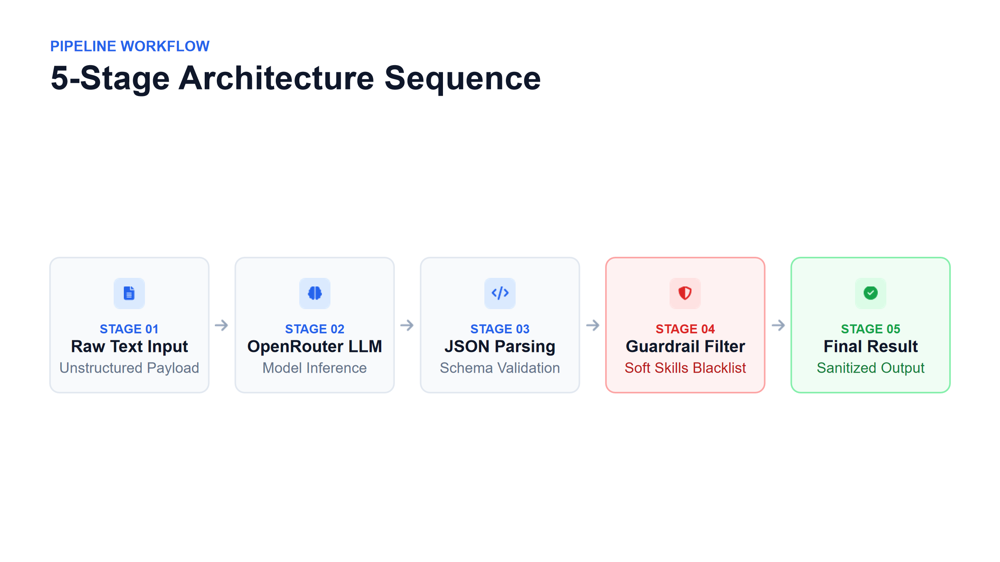

# Resume Information Extractor

## 🎥 Demo Video
[Insert your 5-minute video link here once recorded]

## 📌 Persona & Problem Statement
- **Persona:** HR Recruiter processing hundreds of resumes daily.
- **Problem:** Manual data entry is time-consuming (30s per resume) and error-prone.
- **Solution:** An LLM-powered pipeline converting unstructured text to structured data.

## 🏗️ Architecture Diagram

*Flow: Raw Text -> OpenRouter LLM -> JSON Parsing -> Guardrail Filter -> Final Output.*

## 📊 Metrics: Targeted vs. Reached
| Metric | Targeted | Reached |
|---|---|---|
| Name Accuracy | > 85% | **100%** |
| Email Accuracy | > 95% | **100%** |
| Skills Accuracy | > 70% | **100%** (With Guardrails) |
| Years Accuracy | > 80% | **88%** |
| **Overall Accuracy** | > 80% | **88%** |

*Iteration Note: Strict matching initially yielded 52%. By introducing Smart Matching (84%) and Guardrails (88%), accuracy was significantly improved.*

## 💰 Cost Analysis (Build vs. Buy)
- **Build:** Prompt engineering, JSON parsing, and Guardrails.
- **Buy:** OpenRouter API (Free tier / Apodex model) + Google Colab.
- **Cost per resume:** ~$0.00 (Free) vs. $0.25 SGD (Manual HR).
- **Conclusion:** High cost-efficiency. Even a premium model (GPT-4o) costs <$0.001 SGD, reducing manual cost by 99%.

## ⚠️ Risks & Limitations
- **Silent Failure:** LLMs hallucinate formats. Mitigated via Guardrails (Regex email validation, soft skill blacklist).
- **Years Inference:** AI failed to infer "just graduated" = 0 years. Requires Human-in-the-loop.
- **Privacy:** Used synthetic data (25 resumes) to comply with PDPA.

## 🚀 How to Run
1. Open `resume_extractor.ipynb` in Google Colab.
2. Upload `ground_truth_25.csv`.
3. Set OpenRouter API Key.
4. Run extraction loop to generate `llm_results.csv`.
5. Run evaluation block to calculate accuracy and apply Guardrails.

## 📂 Evaluations Explainer
- `evaluation_v1_strict.csv`: Strict string matching (52%).
- `evaluation_v2_smart.csv`: Normalized/set-based matching (84%).
- `evaluation_final_v3_guardrails.csv`: Added Guardrails (88%, Skills 100%).
